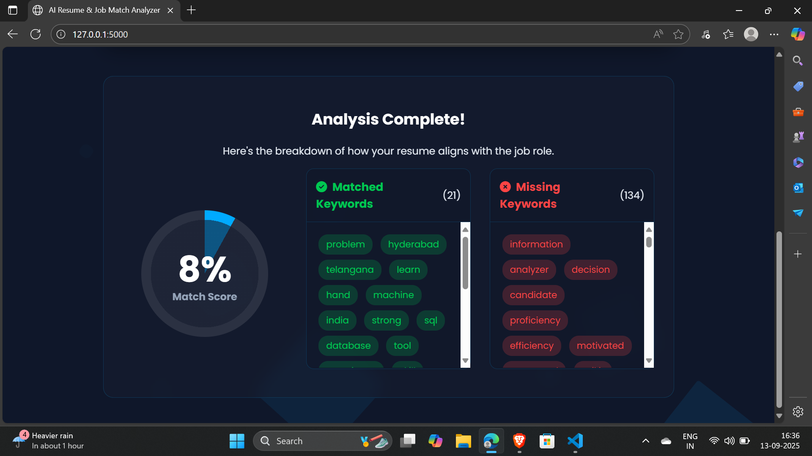

# **AI-Powered Resume Analyzer**

> **Created & Developed by:** [Greeshmanth Basivi](https://www.linkedin.com/in/greeshmanth-basivi-44030a382/)

\
  
\  
\</p\>

## **📖 Overview**

This project is a full-stack web application designed to help job seekers evaluate their resume against a specific job description. By uploading a resume and pasting a job description, users receive an instant percentage-based match score and a highlighted list of keywords that are matched and missing.

The core of this project lies in its NLP engine, which processes and analyzes text to provide a quantitative measure of document similarity.

## **✨ Key Features**

* **📄 PDF & DOCX Parsing:** Extracts text seamlessly from the most common resume file formats.  
* **🧠 NLP-Powered Analysis:** Utilizes **spaCy** for advanced text preprocessing, including lemmatization and stop-word removal.  
* **🎯 Percentage Match Score:** Calculates a precise similarity score using **scikit-learn's** TF-IDF and Cosine Similarity algorithms.  
* **📊 Keyword Highlighting:** Clearly displays which important keywords from the job description are present in the resume and which are missing.  
* **🎨 Modern & Responsive UI:** A sleek, dark-themed interface with dynamic animations and a user-friendly experience.

## 📸 Application Screenshot

## **🛠️ Tech Stack**

* **Backend:** Python, Flask  
* **NLP/ML:** spaCy, scikit-learn  
* **Frontend:** HTML5, CSS3, JavaScript  
* **File Parsing:** PyMuPDF (for PDF), python-docx (for DOCX)

## **🚀 How to Run Locally**

**1\. Clone the repository:**

git clone \[https://github.com/your-username/AI-Resume-Analyzer.git\](https://github.com/your-username/AI-Resume-Analyzer.git)  
cd AI-Resume-Analyzer

**2\. Create and activate a virtual environment:**

\# For Windows  
python \-m venv venv  
.\\venv\\Scripts\\activate

**3\. Install the required dependencies:**

pip install \-r requirements.txt

**4\. Download the spaCy language model:**

python \-m spacy download en\_core\_web\_sm

**5\. Run the Flask application:**

python app.py

**6\. Open your browser** and navigate to http://127.0.0.1:5000.